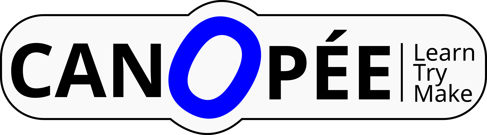

.. meta::
   :description:  Canopée, Formations DAO.
   :keywords: Sketchup, Autocad, Rhino 3D, Grasshopper 3d, Revit, Dynamo BIM, BIM, DAO, CAO, formation, documentation, assistance

.. toctree::
   :maxdepth: 1
   :hidden:

   Formations <cours>
   Documentations <docs>
   Assistance <assist>
   Equipe  <team>
   Erreur <404>
..   Dummy <dummy>

..
   Canopée
   ==========================================================================
   .. image:: images/canopee_logo.png
   :width: 40 %

.. Canopée
.. --------------------------------------------------------------------------

*Formations DAO dans le domaine du bâtiment & génie-civil*

Sketchup // Autocad // Rhino 3D // Revit
============================================================================

..
   .. sidebar:: Téléchargments

   Ce site est disponible au format **PDF**
.. :download:`PDF <./canopee-docs.pdf>`

**Formations** *payantes* sur logiciels de DAO dans le domaine du bâtiment & génie-civil, en phases conception & exécution.

**Documentations** afférentes et **+**,
en *accès libre*.

**Assistance** : Production de contenus 2D/3D,
conseils en organisation d'outils de production,
Forums de discussion.

|Sketchup| est essentiel en phase *esquisse* car du fait de sa simplicité, il permet de libérer la créativité en dessinant *intuitivement*. Comme beaucoup d'autres *petits* logiciels, il a d'abord été développé par *firme1* puis racheté par *Google* et enfin recheté par *Trimble*. Très prisé par les architectes, il permet aussi toutes sortes de visualisation utiles en ingénierie comme pour le simple quidam. En effet, la version *PRO* (~ 800 €) ne diffère de la version *Make* gratuite que part des fonctionalités d'export en ``.dwg`` ... Autant dire que tout le monde s'est approprié ce logiciel, du menuisier au scientifique.

|AutoCAD| est une référence incontournable. Développé depuis presque 40 ans, il est à l'origine de la *domination* de sa maison mère *Autodesk*. Il reste un must pour qui aime documenter ses projets en 2D et permet d'échanger les fichiers au format ``.dwg`` devenu un *standard* de facto.

|Rhino-3d| est le véritable couteau suisse de la DAO. Conçu comme un modeleur 3D dès le départ, son abord un peu compliqué cache une grande puissance. L'achat de la license (~ 1000 €) comme la configuration de l'ordinateur (une carte graphique courante fera parfaitement l'affaire) profiteront aux bourses légères ... L'ajout de |Grasshopper-3d| permet de réaliser des dessins *paramétriques*, cela ouvre la porte à une multitudes de possibilités, de la simulation d'éclairage, conception mécanique ou fabrication assistée par des robots. On entre en plein dans la CAO 2.0 ...

|Revit| **La** référence BIM en France? Ce logiciel devient un standard de facto, même si d'autres sont parfaitement capables dans ce domaine si particulier de B- *I* -M ... Racheté par *Autodesk* il profite de sa puissance (de son écosystème logiciel dominant le marché). L'ajout de |Dynamo| permet aussi de réaliser des dessins *paramétriques* ...

.. image:: images/un-pont.jpg
      :width: 50 %
      :align: left

..
   .. figure:: images/img-tuts.png
     :width: 40px
     :figwidth: 40px
     :align: right

.. sidebar:: Initiations & perfectionnements *à la carte*

   Formations *complètes* ou *détaillées* : **Modules** & **Sessions**

   :doc:`En savoir plus <cours>`

.. sidebar:: Tutoriels & Guides

   Documentations variées : *tutoriels*,
   *guides* et *références*, en accès libre.

   :doc:`En savoir plus <docs>`

.. sidebar:: Assistance

   Production de **contenus** et
   *Implémentation* de **procédures** CAO/DAO.

   :doc:`En savoir plus <assist>`

.. impossible to write a *clean* line after ...
   Pour toute erreur, commentaire positif, etc., écrivez moi :email:`Olivier TURLIER <o.turlier@canopee.org>`
   |site| en version |version| indice |release| du |today|

..
   .. image:: images/logo_sketchup_48x48.png
      :target: SU_
   ..   :target: |Sketchup|

   .. image:: images/logo_acad2017_48x48.png
      :target: ACAD_
   ..   :target: |AutoCAD|

   .. image:: images/logo_rhino3d_48x48.png
      :target: RHINO_
   ..   :target: |Rhino-3d|

   .. image:: images/logo_grasshopper_48x48.png
      :target: GRASHP_
   ..   :target: |Grasshopper-3d|

   .. image:: images/logo_revit_48x48.jpg
      :target: RVT_
   ..   :target: |Revit|

   .. image:: images/logo_dynamo-bim_48x48.png
      :target: DYN_
   ..   :target: |Dynamo|

   .. _SU: https://www.sketchup.com/fr
   .. _ACAD: http://www.autodesk.fr/products/autocad/overview
   .. _RHINO: https://www.rhino3d.com/fr/
   .. _GRASHP: http://www.grasshopper3d.com/
   .. _RVT: http://www.autodesk.fr/products/revit-family/overview
   .. _DYN: http://dynamobim.org/

..
   Formations
   ===========================================================================

   Formations *complètes* ou *détaillées*, sur site ou à distance.
   Programmes généraux ou spécifiquement adaptés.

   :doc:`En savoir plus <cours>`

   Tutoriels & Guides
   ============================================================================

   Documentation en *Accès libre* : **Tutoriels** (docs. courts), **Guides** (docs + complets), **Références** (docs +++ longs.)

   :doc:`En savoir plus <docs>`

   Assistance
   =============================================================================

   Parce que l'informatique n'est pas réduite à un seul logiciel ...
   Assistance dans l'implémentation de *procédures* ou *systèmes* orientés CAO/DAO

   :doc:`En savoir plus <assist>`

.. Canopée
.. ==========================================================================
..
.. Actualités
.. --------------------------------------------------------------------------
..
..
   .. list-table::
..
..    * - .. figure:: /images/img-tuts.png
..          :width: 300 px
..
..          Impression à l'échelle avec AutoCAD +
..          Affichage dans Rhino-3d
..
..      - .. figure:: /images/img-guides.png
..          :width: 300 px
..
..          Mise en page avec AutoCAD +
..          Mise en page avec Rhino-3d
..
..
..      - .. figure:: /images/img-refs.png
..          :width: 300 px
..
..          Configuration d'AutoCAD

.. for opening links in another tab, not in the same window, can be confusing fo *noobs* visitors

   You can |location_link|.

   .. |location_link| raw:: html

      <a href="http://geoiptool.com" target="_blank">check your location here</a>

   So transforming those hyperlinks for that purpose, and changing from ``Rhino-3d_`` to ``|Rhino-3d|`` link might work

   .. _Rhino-3d: https://www.rhino3d.com/fr/

   .. _Grasshopper-3d: http://www.grasshopper3d.com/

   .. _AutoCAD: http://www.autodesk.fr/products/autocad/overview

   .. _Sketchup: https://www.sketchup.com/fr

   .. _Revit: http://www.autodesk.fr/products/revit-family/overview

   .. _Dynamo: http://dynamobim.org/

.. |Rhino-3d| raw:: html

   <a href="https://www.rhino3d.com/fr/" target="_blank">Rhinocéros 3D </a>

.. |Grasshopper-3d| raw:: html

   <a href="http://www.grasshopper3d.com/" target="_blank">Grasshopper 3D </a>

.. |AutoCAD| raw:: html

   <a href="http://www.autodesk.fr/products/autocad/overview" target="_blank">AutoCAD </a>

.. |Sketchup| raw:: html

   <a href="https://www.sketchup.com/fr" target="_blank">Sketchup </a>

.. |Revit| raw:: html

   <a href="http://www.autodesk.fr/products/revit-family/overview" target="_blank">Revit</a>

.. |Dynamo| raw:: html

   <a href="http://dynamobim.org/" target="_blank">Dynamo </a>
