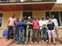

.. meta::
   :description:  Canopée, Formations DAO.
   :keywords: Sketchup, Autocad, Rhino 3D, Grasshopper 3d, Revit, Dynamo BIM, BIM, DAO, CAO, formation, documentation, assistance

Témoignages
=================

`NINA <http://nina.no/>`_: "Paolo has been instructor 3 times for technicians and researchers in the **Norwegian Institute for Nature Research -NINA-**. He has made a QGIS new beginners course, a QGIS advanced course as well, as a Lizmap course specifically to fulfill the needs of the institute. He is a very experienced instructor, patient and willing to help the attendees. We are very much satisfied with the courses that make a quick off for starting to use this efficient tools. Thanks Paolo and Faunalia!"

------

**Howard Frederick** - *QGIS and PostGIS training* in Arusha for the `Tanzania Conservation Resource Centre <http://www.tzcrc.org/>`_: "We were fortunate to have Paolo Cavallini come and teach an advanced course in PostGIS with QGIS in Arusha in December 2015, the second time he has come to Tanzania to teach. Students were able to get into PostGIS very quickly, turning out some excellent analyses and getting the basics of setting up, administering and using a PostGIS database on their personal machines."

------

**Vous aussi envoyez-nous vos commentaires** `Votre-Avis`_  - Merci!

.. _Votre-Avis: info@canopee.org?subject=Avis

.. image:: images/logo_sketchup_48x48.png
   :target: SU_
..   :target: |Sketchup|

.. image:: images/logo_acad2017_48x48.png
   :target: ACAD_
..   :target: |AutoCAD|

.. image:: images/logo_rhino3d_48x48.png
   :target: RHINO_
..   :target: |Rhino-3d|

.. image:: images/logo_grasshopper_48x48.png
   :target: GRASHP_
..   :target: |Grasshopper-3d|

.. image:: images/logo_revit_48x48.jpg
   :target: RVT_
..   :target: |Revit|

.. image:: images/logo_dynamo-bim_48x48.png
   :target: DYN_
..   :target: |Dynamo|

.. _SU: https://www.sketchup.com/fr
.. _ACAD: http://www.autodesk.fr/products/autocad/overview
.. _RHINO: https://www.rhino3d.com/fr/
.. _GRASHP: http://www.grasshopper3d.com/
.. _RVT: http://www.autodesk.fr/products/revit-family/overview
.. _DYN: http://dynamobim.org/
